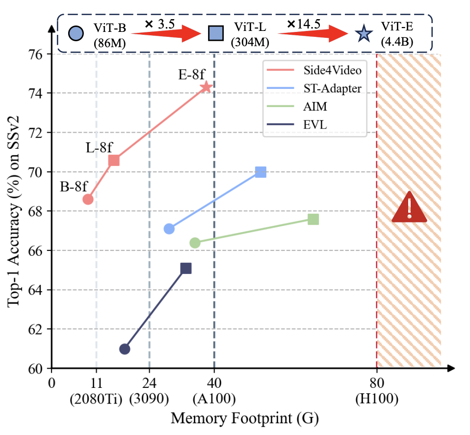
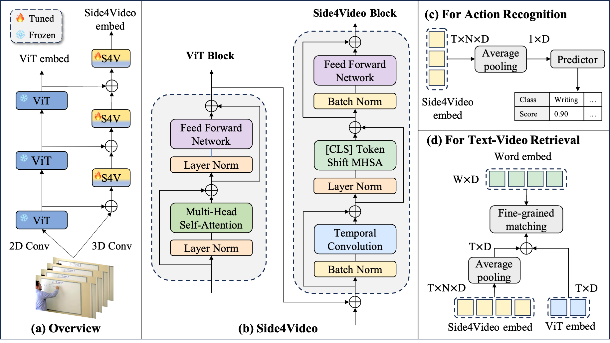

<div align="center">

<h1> Side4Video: Spatial-Temporal Side Network for Memory-Efficient Image-to-Video Transfer Learning
</div>

This repository is the official implementation of [Side4Video](https://arxiv.org/abs/2311.15769), which significantly reduces the training memory cost for action recognition and text-video retrieval tasks. Our code will be released soon!
<div align=center>

</div>

<!--[](https://arxiv.org/abs/2307.08908)-->

## 📰 News
<!-- - [ ] We will release code soon.-->
- [x] **`Nov 28, 2023.`** We release our paper in [arxiv](https://arxiv.org/abs/2311.15769).

## 🗺️ Overview
<!--[The motivation of Side4Video is to reduce the training cost, enabling us to train a larger model with limited resources.-->

<div align=center>

</div>

<!--  -->

## 📊 Results
<div align=center>

</div>
Our best model can achieve an accuracy of 67.3% & 74.6 on Something-Something V1 & V2, 88.6% on Kinetics-400 and a Recall@1 of 52.3% on MSR-VTT, 56.1% on MSVD, 68.8% on VATEX.


## 🖇️ Citation
If you find this repository is useful, please star🌟 this repo and cite🖇️ our paper.
```bibtex
@article{Side4Video,
  title={Side4Video: Spatial-Temporal Side Network for Memory-Efficient Image-to-Video Transfer Learning},
  author={Yao, Huanjin and Wu, Wenhao and Li, Zhiheng},
  journal={arXiv preprint arXiv:2311.15769},
  year={2023}
}
```

## 👍 Acknowledgment
Our implementation is mainly based on the following codebases. We are sincerely grateful for their work.
- [Text4Vis](https://github.com/whwu95/Text4Vis): Revisiting Classifier: Transferring Vision-Language Models for Video Recognition.
- [CLIP4Clip](https://github.com/ArrowLuo/CLIP4Clip): An Empirical Study of CLIP for End to End Video Clip Retrieval.

## 📧 Contact
If you have any questions about this repository, please file an issue or contact Huanjin Yao [](mailto:yaohj22@mails.tsinghua.edu.cn) or Wenhao Wu [](mailto:wenhao.wu@sydney.edu.au).

<!--```
Huanjin Yao: yaohj22@mails.tsinghua.edu.cn
Wenhao Wu: wenhao.wu@sydney.edu.au
```-->
